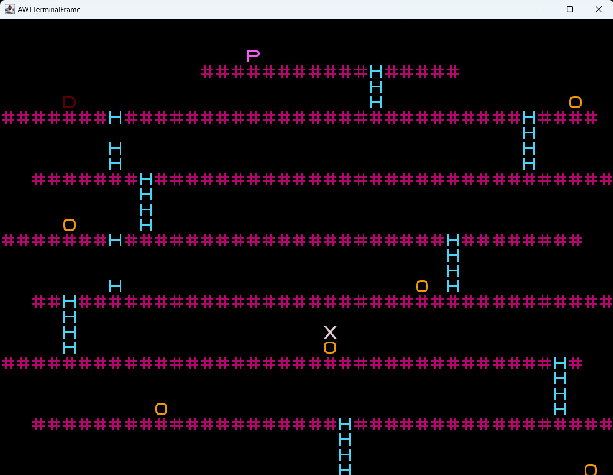
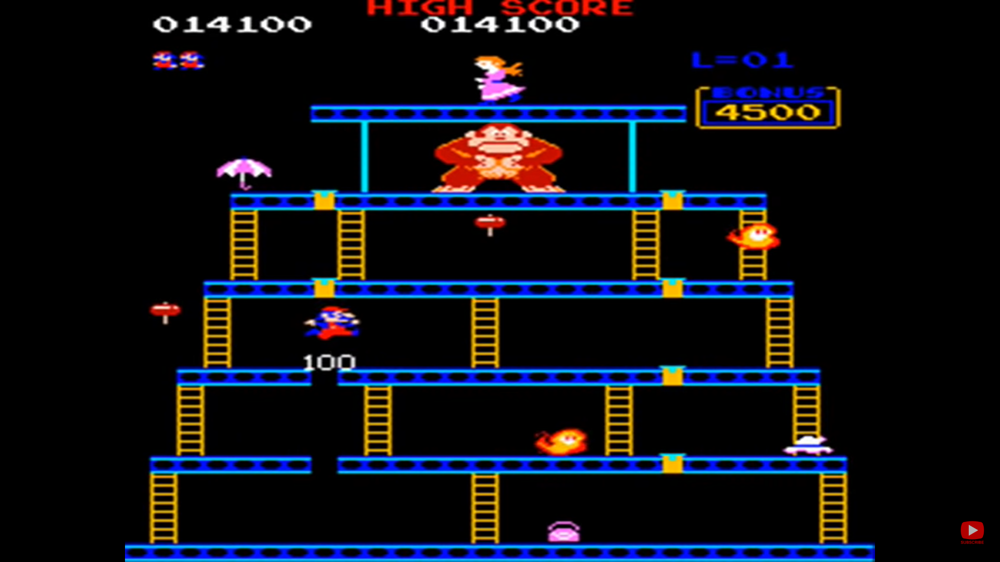
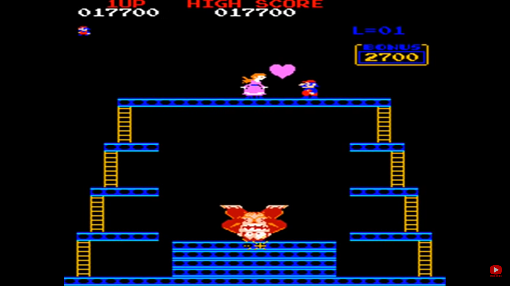
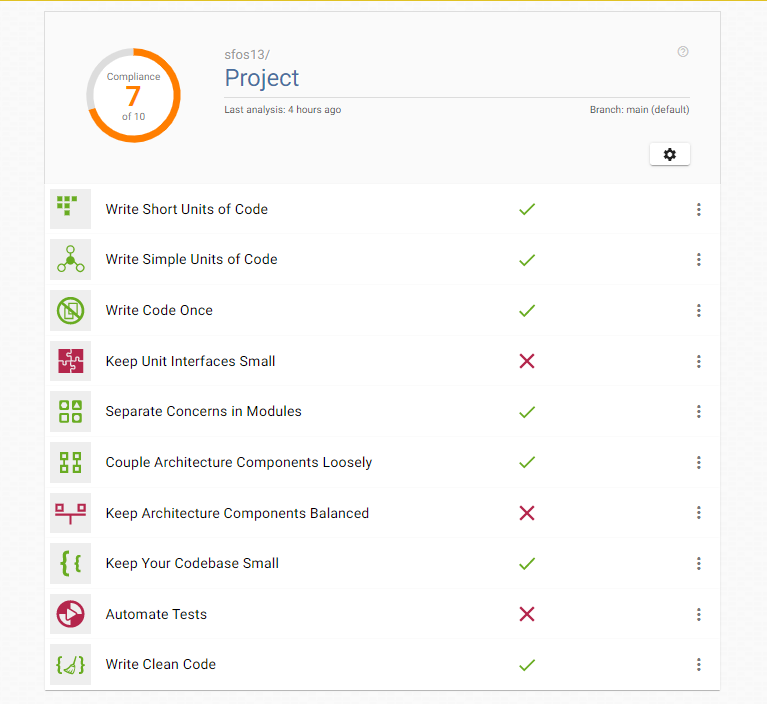

# L00T01G09 - Donkey Kong<PROJECT NAME>

> The project is based on an arcade game of 1981 the 'Donkey Kong'. This charather is the main monster that the jupman (Mario) needs to confront. An important charatheristic is the ability to jump, since it was the first arcade game to incorporate it. Therefore, the goal of the game is for Mario to reach the princess, in the highest floor. But he will have to face Donkey Kong that is on rampage throwing barrels, and climb some dangerous stairs.

>The authors of the project are Nils Rothamel (202203004@fe.up.pt), João Fernandes (202108867@fe.up.pt) and Sara Santos (202108675@fe.up.pt) for LDTS 2022/2023

## IMPLEMENTED FEATURES

**Features:**

- **Mario Movement** - The player can controll the directions that Mario moves. But there are restrictions, you only move to right and left in the floor, and the stairs are the only way to move in the axis of y.

- **Jumping** - Mario (or the char 'X') will jump when the space bar key is pressed.

- **Climbing stairs** - To move to the higher floor it's needed to climb the stairs. Therefore, if the character is in the same position as the stairs (or char 'H'), it can climb. But if the stairs are broken, the action can't be completed.

- **Gravity** - Gravity is very important in Donkey Kong, and it helped in some functions. For example, if Mario isn't on the top of the floor(or char '#'), he automatically falls.

- **Moving Barrels** - The barrels are an important feature in the original game. In this project, they move according to the floor and fall with the action of gravity. When they fall to the  lower floor, they change the tragetory. In other words, if they were moving to the right side, in the next floor, they will move to the left side. Sometimes, they can also come down to the stairs.

- **Winning when reach princess** - Usually, the game ends when  Mario is in the same level as the princess (or char 'P'). The way to win is the same. So, in the floor where the char is, the game ends, and the player can play again or exit.

- **Losing when a barrels hits** - When the barrels (or char 'O') are in the same place as Mario, the game automatically ends, and the player can try again.

- **Losing when is face to face with Donkey Kong** - This feature is similar to the previous, when Mario touches Donkey Kong, the player looses.

**Screenshots of the Game**

## PLANNED FEATURES

**Future Features:**

- **Hammer** - Instead of only jumping to bypass the barrels, Mario has a tool (the hammer) to destroy them, pressing 'X'.

- **Two Different Levels** - On the actual model, it has just one level, but it will have two, with higher difficulty, different rules, and goals. Because of the new elements added and more complex design.

- **Tilted Floor** - In the first level, the floor won't be straight, to add difficulty to the gameplay and the program itself.

- **New Elements** - In the present level, to win, Mario needs to go to the highest floor. But new elements will be added, like a different floor where Mario needs to jump to make Donkey Kong fall or new types of barrels.

- **Different Menus with More Options** - Currently, the menus are very similar and simple, and don't have options like instructions. In the future, they will be more appealing and easy to understand.

- **Different Draw Methods** - The characters are based on just one char, and elements like floors or stairs are longer and have spaces between them. The next delivery will have more detail and better graphics.

**Mocks**

>**Level 1** - More similar to the original game with titled floor and a hammer that needs to be collected.

>**Level 2** - Instead of a titled floor, the levels of floor are proportional to each other. The goal also change: Mario need to jump all 8 yellow blocks in the floor to Donkey Kong fall and end the game.

<<<<<<< HEAD
=======
## DESIGN

### UML

### MVC (Model–View–Controller)

**Problem in Context**

From a beginner's point of view, it's difficult to create a game and connect all the dots. Because the user wants to have his commands interpreted, stored, easily seeable, and for them to have logical behind. This Design Pattern is a solution that puts it all together in a easy way.

**The Pattern**

All the game has a base in this architecture. Therefore, the View is a representation of the data put by the user, the Controller is who manipulates according to the user, and the Model represents the part of the logic behind data in the game.

**Implementation**

In the game it's visible where each component is:

- [Controller](src/main/java/com/aor/DK/controller)
- [Viewer](src/main/java/com/aor/DK/Viewer)
- [Model](src/main/java/com/aor/DK/model)

**Consequences**

Some benefits:

- Easy to test independently and to maintain
- Features are reusable
- Can be easily extended
- Facilitates collaborative work
- Separation of these three different components, separate responsibilities, and the independence between input and output

Some disadvantages:

- High complexity
- Difficult to understand 

### Factory Method
**Problem in Context**

The problem is based on the many components that need to be represented, and, also, the resemblances between the components. So, the game must have a Design Pattern to not implement the same code twice or more. For example, Mario and the Princess are both chars, they are different because of their color and the chosen char, but the method to draw is the same.

**The Pattern**

The Pattern creates objects without exposing the instantiation logic to the client.
So, the creator can create a standard way to create objects, but it can be easily overriden.

**Implementation**

In the game it's visible where each component is:

Interface:
- [GenericViewer](src/main/java/com/aor/DK/Viewer/GenericViewer.java)

Abstract Class:
- [Viewer](src/main/java/com/aor/DK/Viewer/Viewer.java)

Examples of subclasses:

- [MenuViewer](src/main/java/com/aor/DK/Viewer/MenuViewer.java)
- [BarrelViewer](src/main/java/com/aor/DK/Viewer/BarrelViewer.java)

**Consequences**

Some benefits:

- Easy to test  and maintain
- Create a design more customizable
- Polymorphic creation is possible
- Subclasses are proliferate
- Single Responsibility Principle

Some disadvantage:
- High complexity because of the many subclasses that need to implement

### State

**Problem in Context**

Actually, the game only has two state (Menu and Game Play) on the graphic interface, and on controller. In the future, the game will have more, so it's important to has a way to implement the different stages, in different times of the gameplay. So the code its easier to implement and comprehend.

**The Pattern**

State Pattern is a Behavioral software design pattern, so it's a way to solve similar recurring issues. When its internal state changes, alter its behavior.Within any unique state, the program behaves differently, and the program can be switched from one state to another instantaneously.

**Implementation**

In the game is visible where each component is:

- [Controller](src/main/java/com/aor/DK/controller)
- [Viewer](src/main/java/com/aor/DK/Viewer)
- [Model](src/main/java/com/aor/DK/model)

**Consequences**

Some benefits:

- Single Responsibility Principle
- Simplify the code
- Open/Closed Principle

Some disadvantage:
- Finite number of states

### Game Loop Pattern

**Problem in Context**

A situation that occurs frequently is what happened previously in MVC. So the user makes an action, and then the controller handles input, the model updates the game and in the end it is visible because of the viewer.
This happens always the same way, so the game needs to handle this sequence of events without using a 'while' or a 'for'.

**The Pattern**

It's used in almost every game, and it's considered one of the basics of programming, avoiding inserting repeated data. It tracks the passage of time and with each turn of the loop, it processes user input without blocking. For example, this could've been used to define that Donkey Kong throws barrels until Mario reaches the top floor

**Implementation**

In the game it's visible where each component is:

- [Controller](src/main/java/com/aor/DK/controller)
- [Viewer](src/main/java/com/aor/DK/Viewer)
- [Model](src/main/java/com/aor/DK/model)

**Consequences**

Some benefits:
- A very common tool in games
- Easy to use and define
- Easy to understand when it can be used

#### KNOWN CODE SMELLS AND REFACTORING SUGGESTIONS

The raking that the game obtain 7 out 10, in the app 'Better Code Hub'. 
Some errors that are visible: the unit interfaces aren't small. 

- For example, [BarrelController](src/main/java/com/aor/DK/controller/game/BarrelController.java) in the unit 'step' (BarrelController.step(Game,GUI.ACTION,long)) has 16 lines of code with 3 parameters. There are used a 'for' with 3 'if'. A suggestion was using game loop, but a better one is using the states pattern because the barrel has 3 state (when is going to the left, to the right and down).
- In the [MarioController](src/main/java/com/aor/DK/model) also the unit has a lot of lines (26), because of the quantity of 'if' that exists. The code can be simplified, but it was easier to implement in that way.
- Both are bloaters that represent large class and long parameter list

Other error is the level of code isn't balanced, where the package [arena](src/main/java/com/aor/DK/model/arena) has the highest level of lines with a total of 244 lines, another pachage is [game](src/main/java/com/aor/DK/controller/game) with 139 lines when is compared with [menu](src/main/java/com/aor/DK/model/menu) (27 lines).

- In [Arena](src/main/java/com/aor/DK/model/arena/Arena.java) has a lot of classes, a lot of them are Data Classes like getWidth, setMario and setBarrels (getters and setters). They can be a 'Self Encapsulate Field' and should remove the setting method's.
- In [MarioController](src/main/java/com/aor/DK/controller/game/MarioController.java)  there are a lot of 'if', that can replace conditional with polymorphism and should decompose conditional in the last class.

### TESTING

- Link to mutation testing report.

### SELF-EVALUATION

Every element worked on the project in different ways. Also we did some important meetings that helped to solve problems, and create the necessary solutions. So, we believe that everybody deserves the same percentage(33%).
