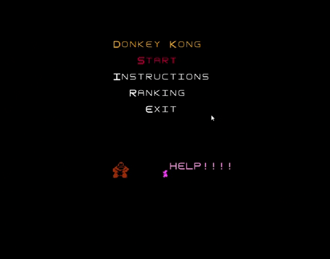

# L00T01G09 - Donkey Kong<PROJECT NAME>

> The project is based on an arcade game of 1981 the 'Donkey Kong'. The monkey (Donkey Kong) is the main enemy who Mario (the jumpman) has to fight against. An important characteristic is the ability to jump, since it was the first arcade game to incorporate it. Therefore, the goal of the game is for Mario to reach the princess, in the highest floor. But he will have to face Donkey Kong that is on rampage throwing barrels, and climb some dangerous stairs.

>The authors of the project are Nils Rothamel (202203004@fe.up.pt), João Fernandes (202108867@fe.up.pt) and Sara Santos (202108675@fe.up.pt) for LDTS 2022/2023

## IMPLEMENTED FEATURES

  

  <b><i>Gif 1. Instructions</i></b>

 
 

  

  <b><i>Gif 2. Lost in Level 1</i></b>

 
 

  

  <b><i>Gif 3. Jumping</i></b>

 
 

  

  <b><i>Gif 4. Winning level 1</i></b>

 
 

  

  <b><i>Gif 5. Lost in level 2</i></b>

 
 

  

  <b><i>Gif 6. Winning the game</i></b>

 
 

  

  <b><i>Gif 7. Ranking</i></b>

 
 