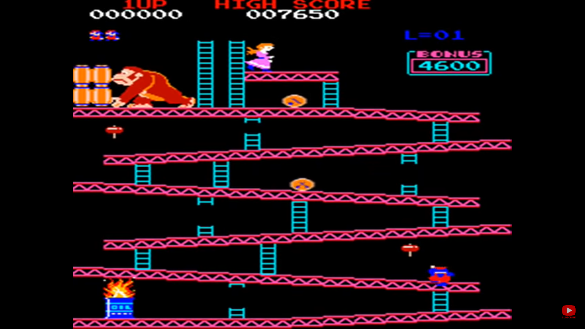
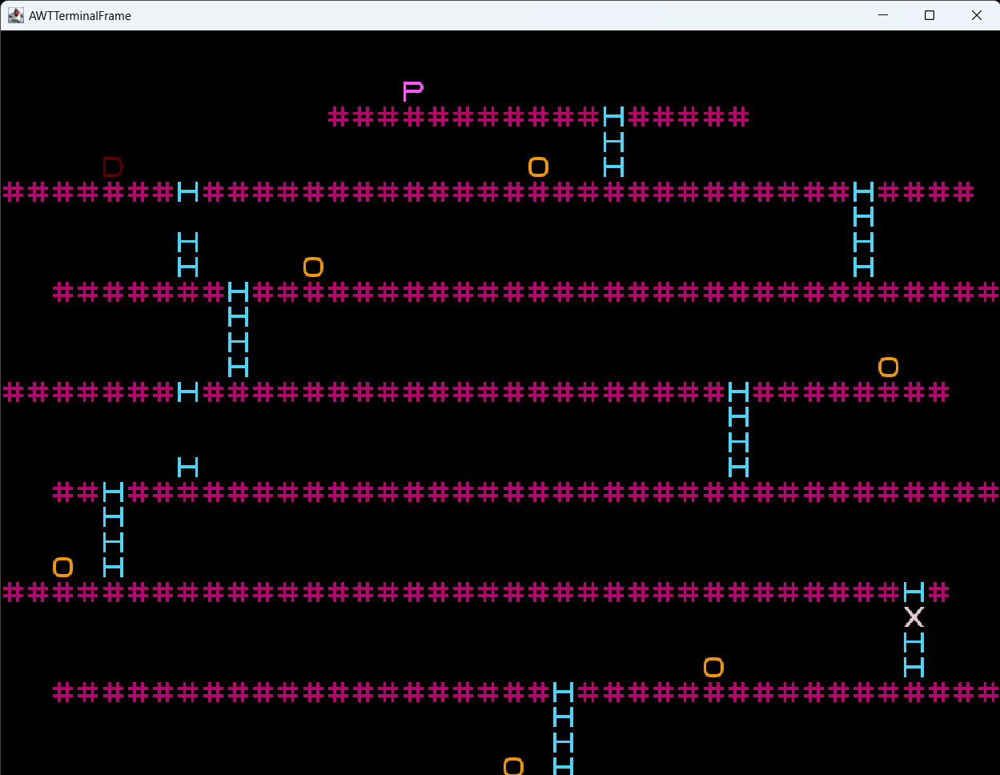
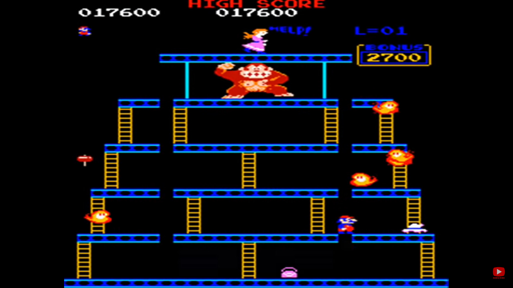
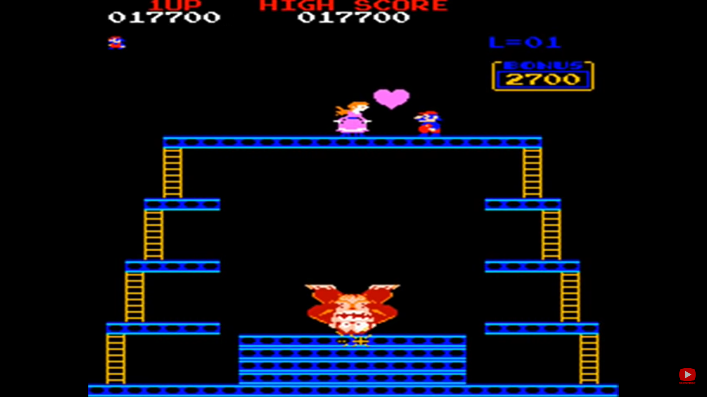
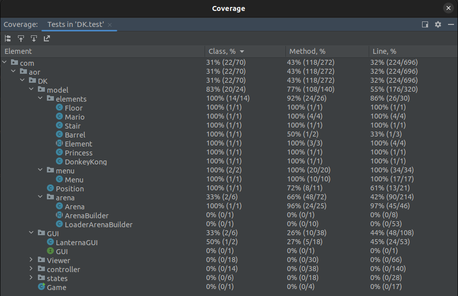
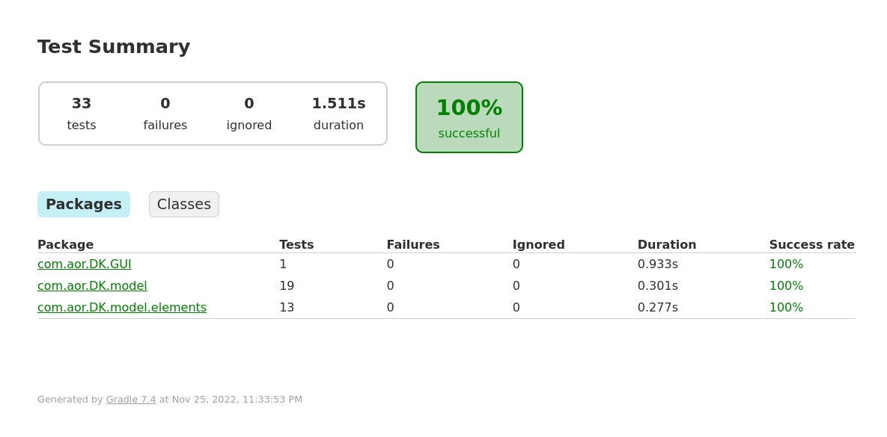

# L00T01G09 - Donkey Kong<PROJECT NAME>

> The project is based on an arcade game of 1981 the 'Donkey Kong'. The monkey (Donkey Kong) is the main enemy who Mario (the jumpman) has to fight against. An important characteristic is the ability to jump, since it was the first arcade game to incorporate it. Therefore, the goal of the game is for Mario to reach the princess, in the highest floor. But he will have to face Donkey Kong that is on rampage throwing barrels, and climb some dangerous stairs.

>The authors of the project are Nils Rothamel (202203004@fe.up.pt), João Fernandes (202108867@fe.up.pt) and Sara Santos (202108675@fe.up.pt) for LDTS 2022/2023

## INDEX

- [Implemented Features](#implemented-features)
  - [Screenshots](#screenshots)
    - [Level 1](#level-1)
    - [Level 2](#level-2)
    - [Menus](#menus)
    - [Between Levels](#between-levels)
    - [Others](#others)
- [Design](#design)
  - [UML](#uml)
  - [Design Patterns]
  - 

## IMPLEMENTED FEATURES

**Features:**

- **Mario Movement** - The player can control the directions that Mario moves. But there are restrictions, you only move to right and left on the floor, and the stairs are the only way to move vertically.

- **Jumping** - Mario will jump when the space bar is pressed.

- **Climbing stairs** - To move to the higher floor it's needed to climb the stairs. Therefore, if the character is in the same position as the stairs, it can climb. But if the stairs are broken, the action can't be completed.

- **Gravity** - Gravity is very important in Donkey Kong, and it helps in some functions. For example, if Mario isn't standing on the floor, he automatically falls.

- **Moving Barrels according to the floor** - The barrels are an important feature in the original game. In this project, they move according to the floor. When they fall to the lower floor, they change the direction. In other words, if they were moving to the right side, in the next floor, they will move to the left side. Sometimes, they can also roll down the ladders.

- **Random Barrels move  down the stairs** - Another important feature is the ability to some barrels move down the stairs. The decision of the barrel go down the stair or continue in the floor is random, so every time the level 1 is played is a different level.

- **Two Different Levels** - The game has two different levels, with different rules, and goals. Because of the new elements added and more complex design.

- **Two Different Levels Map** - Besides the different monsters and conditions, there are also two different maps. They differ in the location of the stairs and floor, and also the inclusion of switches.

- **Losing through a barrel hit** - When a barrel is in the same place as Mario, the game automatically ends, and the player can try again.

- **Losing when face to face with Donkey Kong** - This feature is similar to the previous, when Mario touches Donkey Kong, the player looses.

- **Fire element** - They are different ´monsters´ than the barrels because of the way they move: slower, up and down the stairs, and just one part of the floor. 

- **Switch element** - These elements are important because of the final winning condition, where the Mario touches them, and they change the color from yellow to green.

- **Jump Score** - Which time that Mario jump a fire element or a barrel, is added to the jump score 100 points.

- **Time Score** - The time score starts with 5000 each level, when it passes 3 seconds these reduce 100 points of the initial score. 

- **Ranking** - After the gameplay, winning or losing, the player can register his name, and will update the scoreboard if he is one of the best players.  

- **Visuals** - The game uses a font that was made by the group. Where the mario has different visuals when is running to the left, or right or climbing the stairs. Also, the Donkey Kong, the Princess, the Fires, the Barrels, the Stairs has a more real view.

- **Instructions** - In the initial menu, the player can see some instructions, where see what which character means and they job.

- **Between Levels** - Before each level starts, it appears a window that is similar to the original game.

- **Menu** - There are different menu's, and it depends on losing or winning, or if it is the initial one.

- **Winning conditions** - Usually, the game ends when Mario is in the same level as the princess. Unless in the second level, where the goal is to touch the switchers and make the Donkey Kong fall.

- **Donkey Kong Falls** - When the player wins the game, it appears another window that shows the Donkey Kong in the last floor, like the original game. So it was used a different map to obtain the image.

### Screenshots 

### Level 1

  

  <b><i>Img 1. Original Level 1</i></b>

 
 

  

  <b><i>Img 2. Level 1 - First Deliver</i></b>

 
 

  

  <b><i>Img 3. Level 1 - Second Deliver</i></b>

 
 

### Level 2

  

  <b><i>Img 4. Level 2 - Original Game</i></b>

 
 

  

  <b><i>Img 5. Level 2 - Gameplay</i></b>

 
 

  

  <b><i>Img 6. Level 2 - End - Original Game</i></b>

 
 

  

  <b><i>Img 7. Level 2 - End</i></b>

 
 

### Between Levels

  

  <b><i>Img 8. Between Levels - Original Game</i></b>

 
 

  

  <b><i>Img 9. Between Levels - End</i></b>

 
 

### Menus

  

  <b><i>Img 10. Initial Menu</i></b>

 
 

  

  <b><i>Img 11. Lost Menu</i></b>

 
 

  

  <b><i>Img 12. Win Menu</i></b>

 
 

### Others

  

  <b><i>Img 13. Instructions </i></b>

 
 

  

  <b><i>Img 14. Player Name</i></b>

 
 

  

  <b><i>Img 15. Ranking</i></b>

 
 

## DESIGN

### UML

  

  <b><i>Img 16. UML</i></b>

 
 

### MVC (Model–View–Controller)

**Problem in Context**

From a beginner's point of view, it's difficult to create a game and connect all the dots. Because the user wants to have his commands interpreted, stored, easily viewable, and being logical for them. This Design Pattern is a solution that puts it all together in a easy way.

**The Pattern**

The whole game is based on the MVC architecture. Therefore, the View is a representation of the input data by the user, the Controller manipulates the Model according to the users input, and the Model represents the logical part of the backend data in the game.

**Implementation**

In the game it's visible where which component is implemented:

- [Controller](../src/main/java/com/aor/DK/controller)
- [Viewer](../src/main/java/com/aor/DK/viewer)
- [Model](../src/main/java/com/aor/DK/model)

**Consequences**

Some benefits:

- Easy to test independently and to maintain
- Features are reusable
- Can be easily extended
- Facilitates collaborative work
- Separation of these three different components, separate responsibilities, and independence between input and output

Some disadvantages:

- High complexity
- Difficult to understand

### Factory Method
**Problem in Context**

The problem is based on the high count of components that need to be represented and also the resemblances between the components. So, the game must have a Design Pattern to not implement the same code twice or more. For example, Mario and the Princess are both chars, they differ in their color and the chosen char, but the method to draw is the same.

**The Pattern**

The Pattern creates objects without exposing the instantiation logic to the client.
So, the creator can create a standard way to create objects, but it can be easily overridden/customized.

**Implementation**

In the game it's visible where which component is implemented:

Interface:
- [GenericViewer](../java/com/aor/DK/Viewer/GenericViewer.java)

Abstract Class:
- [Viewer](../java/com/aor/DK/Viewer/Viewer.java)

Examples of subclasses:

**Consequences**

Some benefits:

- Easy to test and maintain
- Create a design more customizable
- Polymorphic creation is possible
- Subclasses are proliferate
- Single Responsibility Principle

Some disadvantage:
- High complexity because of the many subclasses that need to implement

### State

**Problem in Context**

Actually, the game only has two states (Menu and Game Play) on the graphic interface, and on controller. In the future, the game will have more, because of the implementation of different stages at different parts of the gameplay. So the code is easier to implement and comprehend.

**The Pattern**

State Pattern is a Behavioral software design pattern, it's a way to solve similar recurring issues. When the internal state changes, alters its behavior. Within any unique state, the program behaves differently, and the program can be switched from one state to another instantaneously.

**Implementation**

In the game it's visible where which component is implemented:

- [Controller](../java/com/aor/DK/controller)
- [Viewer](../java/com/aor/DK/Viewer)
- [Model](../java/com/aor/DK/model)

**Consequences**

Some benefits:

- Single Responsibility Principle
- Simplify the code
- Open/Closed Principle

Some disadvantage:
- Finite number of states

### Game Loop Pattern

**Problem in Context**

A situation that occurs frequently is what happened previously in MVC. So the user makes an action, and then the controller handles the input, the model updates the game and in the end it is visible because of the updated viewer.
This happens always the same way, so the game needs to handle this sequence of events without using a 'while' or a 'for' loop.

**The Pattern**

It's used in almost every game, and it's considered one of the basics of programming, avoiding inserting repeated data. It tracks the passage of time and with each turn of the loop, it processes user input without being blocked. For example, this could've been used to define that Donkey Kong throws barrels until Mario reaches the top floor.

**Implementation**

In the game it's visible where which component is implemented:

- [Controller](../src/main/java/com/aor/DK/controller)
- [Viewer](../src/main/java/com/aor/DK/viewer)
- [Model](../src/main/java/com/aor/DK/model)

**Consequences**

Some benefits:
- A very common tool in games
- Easy to use and define
- Easy to understand when it can be used

#### KNOWN CODE SMELLS AND REFACTORING SUGGESTIONS

  

The raking that the game obtain 7 out 10, in the app 'Better Code Hub'.
Some errors that are visible: the unit interfaces aren't small.

- For example, [BarrelController](../java/com/aor/DK/controller/game/BarrelController.java) in the unit 'step' (BarrelController.step(Game,GUI.ACTION,long)) has 16 lines of code with 3 parameters. There are used a 'for' with 3 'if'. A suggestion was using game loop, but a better one is using the states pattern because the barrels have 3 states (when is going to the left, to the right and down).
- In the [MarioController](../java/com/aor/DK/model) the unit has a lot of lines (26), because of a high quantity of 'if' cases. The code can be simplified, but it was easier to implement in that way.
- Both are bloaters that represent large class and long parameter list

Another error is the level of code which isn't balanced, while the package [arena](../java/com/aor/DK/model/arena) has the highest count of lines with a total of 244, the package [game](../java/com/aor/DK/controller/game) in comparison just has 139 lines and the [menu](../java/com/aor/DK/model/menu) package just (27 lines).

  

- In [Arena](../java/com/aor/DK/model/arena/Arena.java) there are a lot of classes, many of them are Data Classes like getWidth, setMario and setBarrels (getters and setters). They can be a 'Self Encapsulate Field' and should remove the setting methods.
- In [MarioController](../java/com/aor/DK/controller/game/MarioController.java) there are a lot of 'if' clauses, that can replace conditional with polymorphism and should decompose conditional in the last class.

### TESTING

  

- [mutation tests](mutation-test-results)

### SELF-EVALUATION

Every element worked on the project in different ways. Also we did some important meetings that helped to solve problems, and create the necessary solutions. So, we believe that everybody deserves the same percentage(33%).
